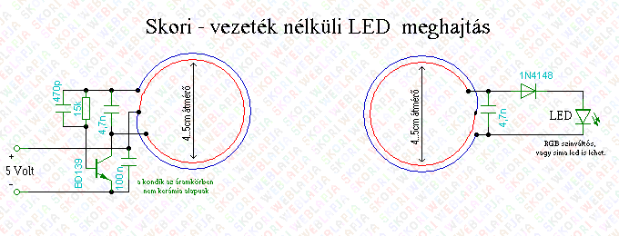

[VISSZA](https://matyasszabolcsik.github.io/portfolio/)
# Skori [Vezeték Nélküli LEd meghajtó] építése / mérése.

#### Kiválasztottunk egy kapcsolási rajzot amit elkészítettünk.

#### Az áramkörben használt alkatrészek értékei:

|Név|Jelölés|Érték|darab|
|----|----|----|----|
|Ellenállás|R1|10...15k|1|
|Kondenzátor|C1, C2|470nF|2|
|Kondenzátor|C3, C5|3,9...4,7nF|2|
|Kondenzátor|C4, C6|100...470nF|2|
|Tranzisztor|T1|BC639|1|
|Dióda|D1|1n4148|1|

#### Az áramkör lerajzolva és az alkatrészek.
