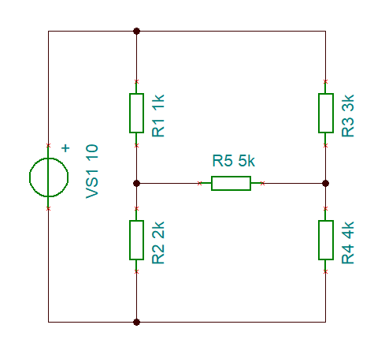
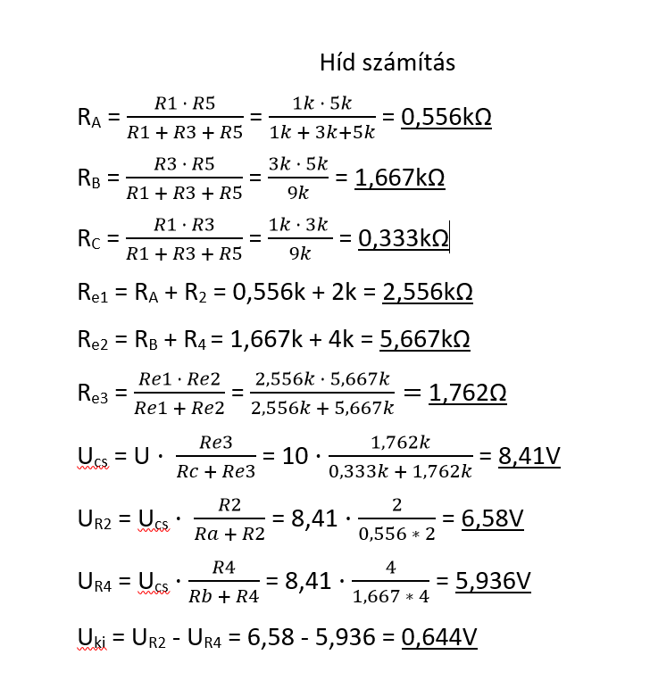
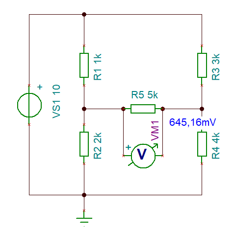

[VISSZA](https://matyasszabolcsik.github.io/portfolio/)
# Hídkapcsolás
#### Project ismertetése
#### Kiegyenlítetlen hídkapcsolás kimeneti feszültségének meghatározása
#### a) Szimulációs méréssel (TINA)
#### b) Valós méréssel (laborban)
#### c) Számítás (delta/csillag átalakítással)
#### Kapcsolási rajz

#### Az áramkörben használt alkatrészek értékei:

|Név|Jelölés|Érték|darab|
|----|----|----|----|
|Áramforrás|U|10V|1|
|Ellenállás|R1|1k|1|
|Ellenállás|R2|2k|1|
|Ellenállás|R3|3k|1|
|Ellenállás|R4|4k|1|
|Ellenállás|R5|5k|1|

#### A áramkör kiszámítása és eredménye

#### A szimulációs mérés eredménye

